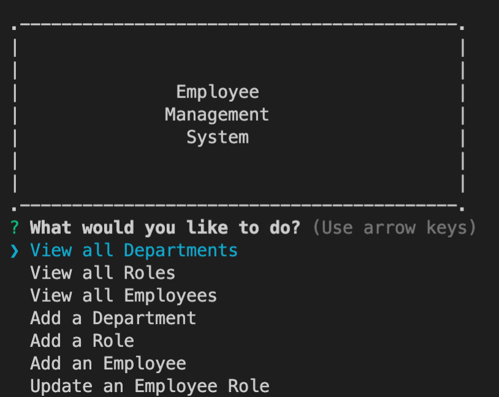

# Employee Tracker 

This project uses a SQL database to categorize company employees, as well as roles and departments. 

UPDATES:
- Project has been updated to correct missing salary input for a new role.

[Link to Walk Through Video](https://watch.screencastify.com/v/ahcvPHkIdlN1V3bTIPaF)
[Link to GitHub Repository](https://watch.screencastify.com/v/ahcvPHkIdlN1V3bTIPaF)

Examples of the Interface:

## Title Screen

This is the first step of maintaining the company's employee database. Users can use the arrow keys to select an option. 

This is an example of one of the tables.